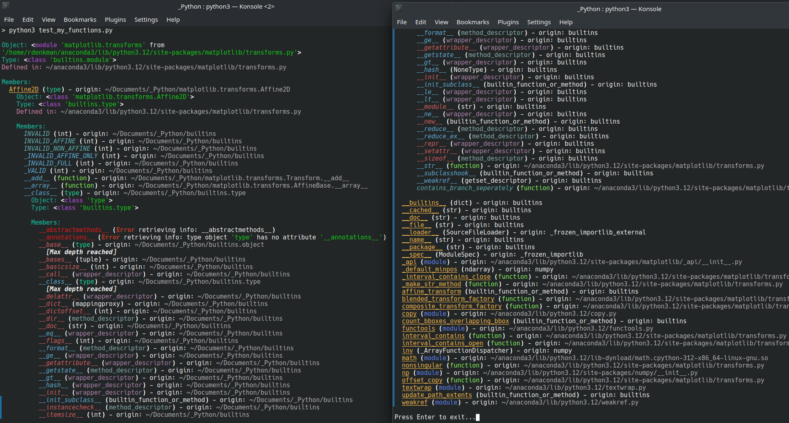

# 🔧 Python Object Explorer (`explore_object_more`)

> A powerful introspection tool for navigating and understanding Python objects — with optional recursion, colored views, tree layouts, and file export.  
> _Enjoy introspecting Python like never before! 🧩_

---

## 🔍 Overview

**`explore_object_more(obj)`** offers deep insight into Python modules, classes, and instances:

- Shows module path, type, and source file
- Lists attributes with type, origin, and optional call chain
- Highlights:
  - 🔐 Private attributes
  - 🧬 Inherited members
  - 🌿 Top-level definitions
- Supports **recursive exploration** of class hierarchies and sub-objects
- Offers multiple output modes:
  - ✅ Terminal color (via [`rich`](https://github.com/Textualize/rich))
  - 📄 Plain-text export (ANSI-free)
  - 📊 Table or 🌲 tree layout

---

## 🛠️ Features

| Option                | Description                                                           |
|-----------------------|-----------------------------------------------------------------------|
| `show_private=True`   | Include names starting with `_`                                       |
| `recursive_bases=True`| Recurse into class bases and inner objects                            |
| `use_table=True`      | Format output as `rich.Table`                                         |
| `use_tree=True`       | Use `rich.Tree` to visualize attribute hierarchy                      |
| `filename="..."`      | Export to plain text (no ANSI codes)                                 |
| `max_depth=3`         | Limit recursion depth                                                 |
| `max_members=None`       | Limit the number of attributes displayed per object                   |
| `console=None`           | Provide a custom `rich.Console` (e.g. for Jupyter or file capture)    |
| `output_file=None`       | Write directly to an open file-like object                            |
| `indent=0`               | Starting indentation level (useful when embedding explorer in scripts) |
| `seen=None`              | Internal cycle protection (avoid infinite recursion)                  |

---

## 🚀 Example Usage

### Python script

```python
from explorer import explore_object_more
import matplotlib.transforms as transforms

explore_object_more(
  transforms,
  show_private=True,
  recursive_bases=True,
  use_tree=True,
  max_depth=2
)

```
or  
### IPython / Jupyter magic

```python
%explore_more matplotlib.transforms.Affine2D --show_private --recursive_bases --max_depth 2

```

## 🧠 Why Use It?

- 🧭 Explore unknown modules, classes, or instances interactively
- 🧱 Understand attribute origin, inheritance, and layout
- 📚 Export summaries for documentation or debugging
- 👨‍🏫 Ideal for teaching, reverse-engineering, and learning Python internals

### 📋 Example Output (Terminal View)

<pre>
🔍 Exploring: &lt;module 'example' from '.../site-packages/example/__init__.py'&gt;

📦 Group: example.module.submodule
├── class ExampleClass
│   ├── __init__(self, x)
│   ├── method: compute(self)
│   └── property: result
└── function: helper(x, y)
</pre>

## 🖥️ Output Examplefor `matplotlib.transforms` module object
<p align="left">
  <a href="Figures/Explore_python_object.png">
    
  </a>
</p>

